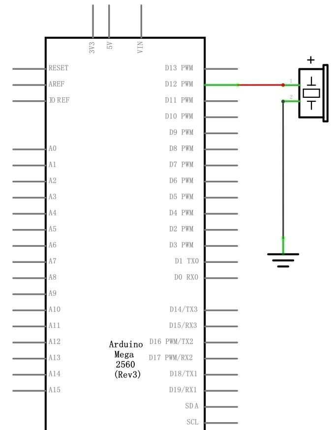
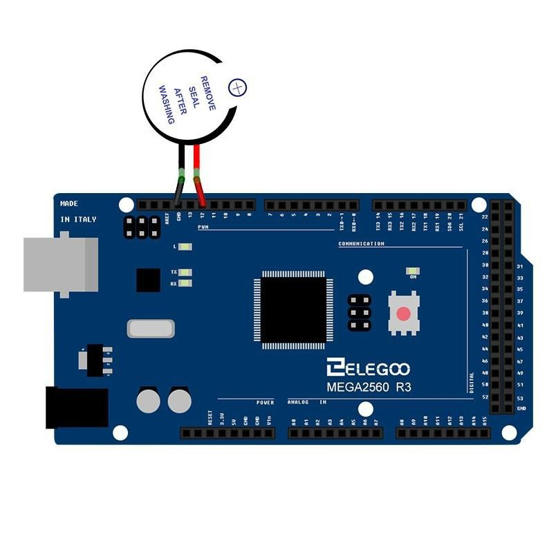

## Active Buzzer

### Overview
In this lesson, you will learn how to generate a sound with an active buzzer.

### Component Required:
- (1) x Elegoo Mega 2560 R3
- (1) x Active buzzer
- (2) x F-M wires (Female to Male DuPont wires)

### Component Introduction

**BUZZER:**
Electronic buzzers are DC-powered and equipped with an integrated circuit. They are widely used in computers, printers, photocopiers, alarms, electronic toys, automotive electronic devices, telephones, timers and other electronic products for voice devices. Buzzers can be categorized as active and passive ones. Turn the pins of two buzzers face up. The one with a green circuit board is a passive buzzer, while the other enclosed with a black tape is an activeone.
The difference between the two is that an active buzzer has a built-in oscillating source, so it will generate a sound when electrified. A passive buzzer does not have such a source so it will not tweet if DC signals are used; instead, you need to use square waves whose frequency is between 2K and 5K to drive it. The active buzzer is often more expensive than the passive one because of multiple built-in oscillating circuits.


**Connection Schematic**



**Wiring Diagram**



### Code
```C++
int buzzer = 12;//the pin of the active buzzer
void setup()
{
  pinMode(buzzer, OUTPUT); //initialize the buzzer pin as an output
}
void loop()
{
  int sound_duration = 500;
  for (int i = 0; i < 20; i++)
  {
    //use the if function to gradually shorten the interval of the sound
    if (i < 5)
    {
      sound_duration = 500;
    } else if (i < 10)
    {
      sound_duration = 300;
    } else if (i < 20)
    {
      sound_duration = 100;
    }
    //activate the active buzzer
    digitalWrite(buzzer, HIGH);
    delay(sound_duration);//wait for sound_duration ms
    //deactivate the active buzzer
    digitalWrite(buzzer, LOW);
    delay(sound_duration);//wait for sound_duration ms
  }
  //activate the active buzzer
  digitalWrite(buzzer, HIGH);
  delay(5000);//keep playing sound for 5 seconds.
}

```