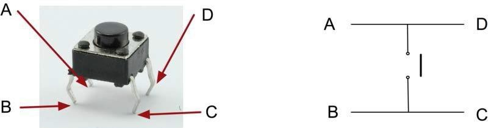
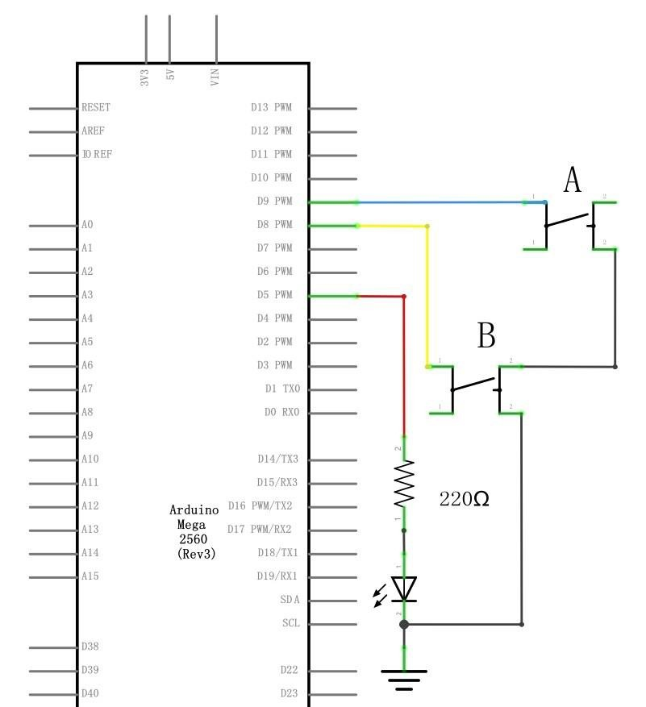
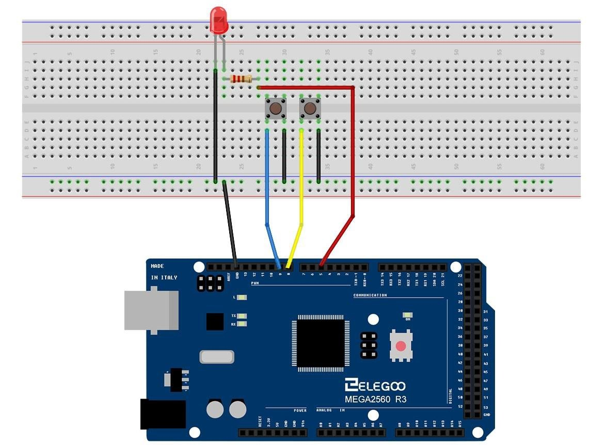
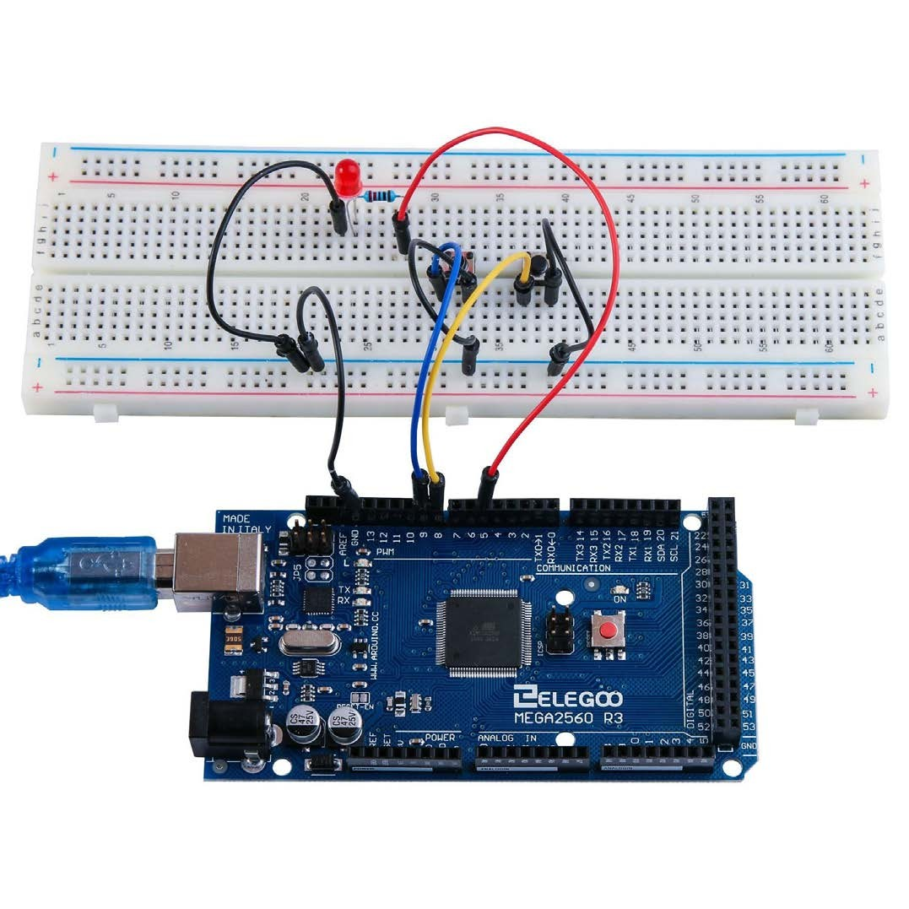

## Digital Inputs

### Overview
In this lesson, you will learn to use push buttons with digital inputs to turn an LED on and off.

Pressing the button will turn the LED on; pressing the other button will turn the LED off.

### Component Required:
- (1) x Elegoo Mega 2560 R3
- (1) x 830 Tie-pointsBreadboard
- (1) x 5mm red LED
- (1) x 220 ohm resistor
- (2) x push switches
- (7) x M-M wires (Male to Male jumperwires)

### Component Introduction
### PUSH SWITCHES:
Switches are really simple components. When you press a button orflip a lever,they connect two contacts together so that electricity can flow through them.
The little tactile switches that are used in this lesson have four  connections, which can be a little confusing.



Actually, there are only really two electrical connections. Inside the switch package, pins B and C are connected together, as are A and D.

**Connection Schematic**



**Wiring diagram**



Although the bodies of the switches are square, the pins protrude from opposite
sides of the switch. This meansthat the pins will only be far enough apart then they are placed correctly on thebreadboard.

Remember that the LED has to have the shorter negative lead to the left.

**Code**
After wiring, please open program in the code folder- Lesson 5 Digital Inputs, and press UPLOAD to upload the program. If errors are prompted, see Lesson 2 for details about the tutorial on program upload.

Load the sketch onto your MEGA 2560 board. Pressing the left button will turn the LED on while pressing the right button will turn it off.

The first part of the sketch defines three variables for the three pins that are to be used. The 'ledPin' is the output pin and 'button pin' will refer to the switch nearer the top of the breadboard and 'buttonBpin' to the other switch.

The 'setup' function defines the ledPin as being an OUTPUT as normal, but now we have the two inputs to deal with. In this case, we use the set the pin Mode to be 'INPUT_PULLUP' like this:
- pinMode(buttonApin, INPUT_PULLUP);
- pinMode(buttonBpin,INPUT_PULLUP);

The pin mode of INPUT_PULLUP means that the pin is to be used as an input, but 
that if nothing else is connected to the input, it should be 'pulled up' to HIGH. In other words, the default value for the input is HIGH, unless it is pulled LOW by the action of pressing the button.

This is why the switches are connected to GND. When a switch is pressed, it 
connects the input pin to GND, so that it is no longer HIGH.

Since the input is normally HIGH and only goes LOW when the button is pressed, the logic is a little upside down. We will handle this in the 'loop'function.
```C++
void loop()
{
    if (digital Read(button pin) == LOW)
    {
        digital Write(led Pin, HIGH);
    }
    if (digital Read(button pin) == LOW)
    {
        digitalWrite(led Pin, LOW);
    }
}
```
In the 'loop' function there are two 'if' statements. One for each button. Each does an 'digitalRead' on the appropriate input.

Remember that if the button is pressed, the corresponding input will be LOW, if button A is low, then a 'digitalWrite' on the ledPin turns it on.

Similarly, if button B is pressed, a LOW is written to theledPin.
