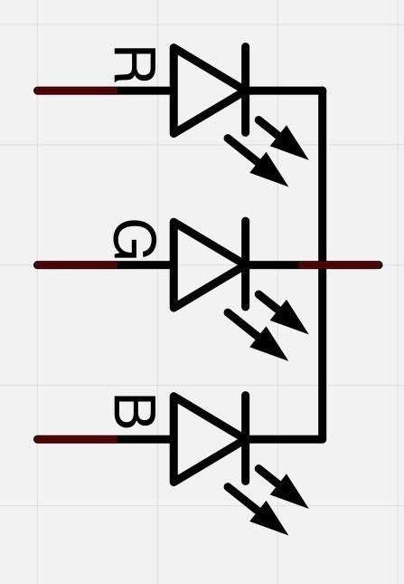
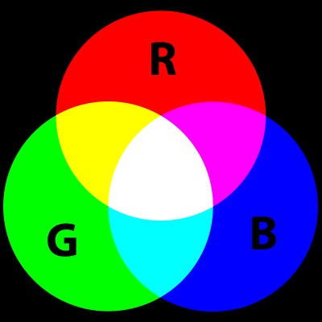
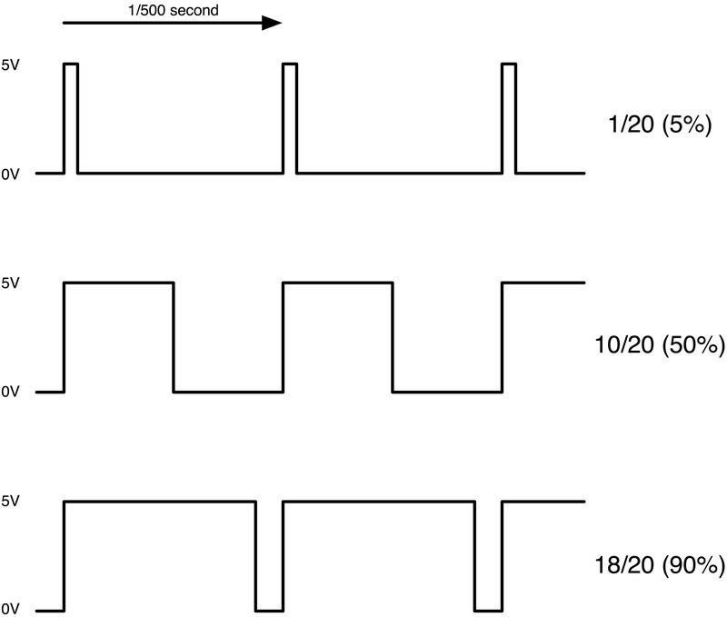
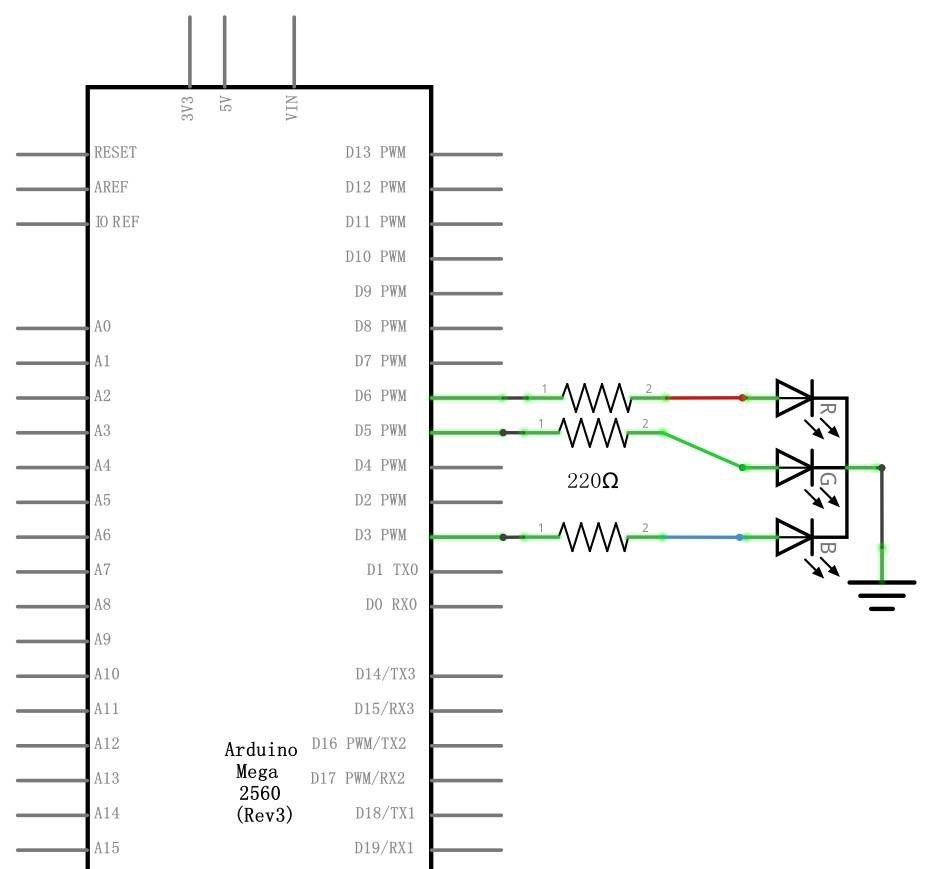
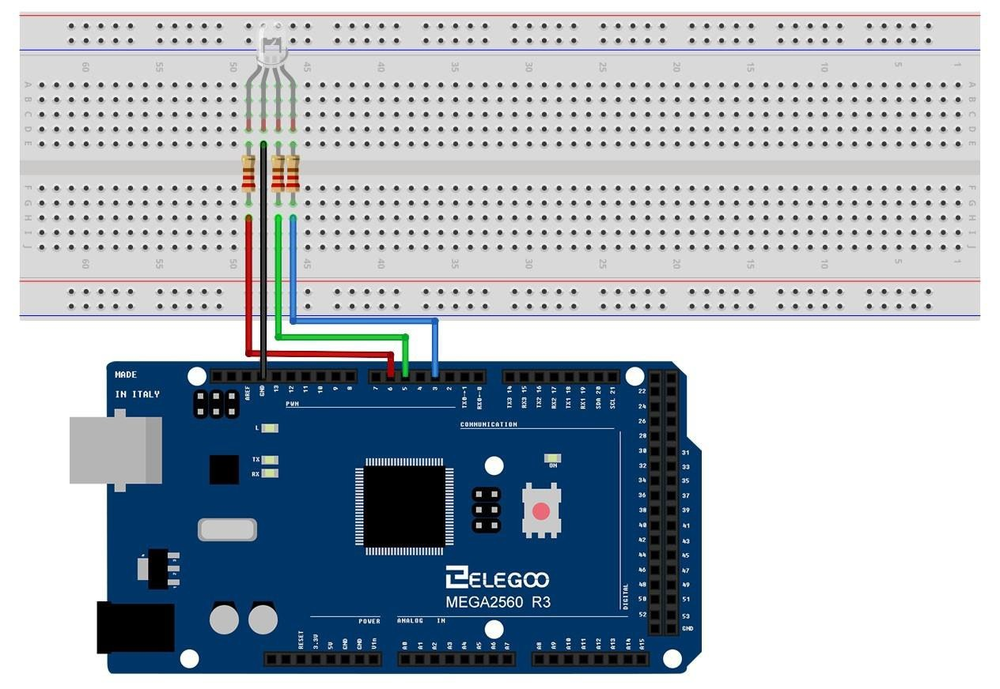
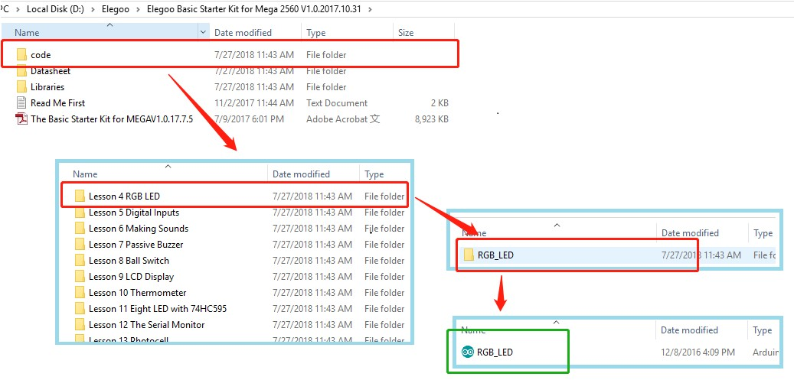

# RGB LED

## Overview

RGB LEDs are a fun and easy way to add some color to your projects. Since they are like 3 regular LEDs in one, how to use and connect them is not much different. They come mostly in 2 versions: Common Anode or Common Cathode. Common Anode uses 5V on the common pin, while Common Cathode connects to ground. As with any LED, we need to connect some resistors inline (3 total) so we can limit the current being drawn. In our sketch, we will start with the LED in the Red color state, then fade to Green, then fade to Blue and finally back to the Red color. By doing this we will cycle through most of the color that can be achieved.

## Component Required:

(1) x Elegoo Mega 2560 R

(1) x 830 Tie Points Breadboard

(4) x M-M wires (Male to Male jumper wires)

(1) x RGB LED

(3) x 220 ohm resistors


## Component Introduction

### RGB:

At first glance, RGB (Red, Green and Blue) LEDs look just like regular LEDs. However, inside the usual LED package, there are actually three LEDs, one red, one green and yes, one blue. By controlling the brightness of each of the individual LEDs you can mix pretty much any color you want. We mix colors the same way you would mix paint on a palette - by adjusting the brightness of each of the three LEDs. The hard way to do this would be to use different value resistors (or variable resistors) as we did with in Lesson 2, but that's a lot of work! Fortunately for us, MEGA 2560 R3 board has an analog Write function that you can use with pins marked with a ~ to output a variable amount of power to the appropriate LEDs. The RGB LED has four leads. There is one lead going to the positive connection of each of the single LEDs within the package and a single lead that is connected to all three negative sides of the LEDs.




Here on the photographs you can see 4 electrode LED. Every separate pin for Green or Blue or Red color is called Anode. You will always connect "+" to it. Cathode goes to "-" (ground). If you connect it other way round the LED will not light. The common negative connection of the LED package is the second pin from the flat side. It is also the longest of the four leads and will be connected to the ground. Each LED inside the package requires its own 220Ω resistor to prevent too much current flowing through it. The three positive leads of the LEDs (one red, one green and one blue) are connected to MEGA 2560 output pins using these resistors.

### COLOR:

The reason that you can mix any color you like by varying the quantities of red, green and blue light is that your eye has three types of light receptor in it (red, green and blue). Your eye and brain process the amounts of red, green and blue and convert it into a color of the spectrum. In a way, by using the three LEDs, we are playing a trick on the eye. This same idea is used in TVs, where the LCD has red, green and blue color dots next to each other making up each pixel.



If we set the brightness of all three LEDs to be the same, then the overall color of the light will be white. If we turn off the blue LED, so that just the red and green LEDs are the same brightness, then the light will appear yellow. We can control the brightness of each of the red, green and blue parts of the LED separately, making it possible to mix any color we like. Black is not so much a color as an absence of light. Therefore, the closest we can come to black with our LED is to turn off all three colors.


## Theory (PWM)

Pulse Width Modulation (PWM) is a technique for controlling power. We also use it here to control the brightness of each of the LEDs. The diagram below shows the signal from one of the PWM pins on the MEGA 2560.



Roughly every 1/500 of a second, the PWM output will produce a pulse. The length of this pulse is controlled by the 'analog Write' function. So 'analog Write(0)' will not produce any pulse at all and ' analog Write(255)' will produce a pulse that lasts all the way until the next pulse is due, so that the output is actually on all the time. If we specify a value in the analog Write that is somewhere in between 0 and 255, then we will produce a pulse. If the output pulse is only high for 5% of the time, then whatever we are driving will only receive 5% of full power. If, however, the output is at 5V for 90% of the time, then the load will get 90% of the power delivered to it. We cannot see the LEDs turning on and off at that speed, so to us, it just looks like the brightness is changing.

## Connection

**Schematic**


**Wiring diagram**


## Code

```C++
#include <Arduino.h>

// Define Pins
#define BLUE 3
#define GREEN 5
#define RED 6

void setup()
{
    pinMode(RED, OUTPUT);
    pinMode(GREEN, OUTPUT);
    pinMode(BLUE, OUTPUT);
    digitalWrite(RED, HIGH);
    digitalWrite(GREEN, LOW);
    digitalWrite(BLUE, LOW);
}

// define variables
int redValue;
int greenValue;
int blueValue;

// main loop
void loop()
{
#define delayTime 10 // fading time between colors

    redValue = 255; // choose a value between 1 and 255 to change the color.
    greenValue = 0;
    blueValue = 0;

    // this is unnecessary as we've either turned on RED in SETUP
    // or in the previous loop ... regardless, this turns RED off
    // analogWrite(RED, 0);
    // delay(1000);

    for (int i = 0; i < 255; i += 1) // fades out red bring green full when i=255
    {
        redValue -= 1;
        greenValue += 1;
        // The following was reversed, counting in the wrong directions
        // analogWrite(RED, 255 - redValue);
        // analogWrite(GREEN, 255 - greenValue);
        analogWrite(RED, redValue);
        analogWrite(GREEN, greenValue);
        delay(delayTime);
    }

    redValue = 0;
    greenValue = 255;
    blueValue = 0;

    for (int i = 0; i < 255; i += 1) // fades out green bring blue full when i=255
    {
        greenValue -= 1;
        blueValue += 1;
        // The following was reversed, counting in the wrong directions
        // analogWrite(GREEN, 255 - greenValue);
        // analogWrite(BLUE, 255 - blueValue);
        analogWrite(GREEN, greenValue);
        analogWrite(BLUE, blueValue);
        delay(delayTime);
    }

    redValue = 0;
    greenValue = 0;
    blueValue = 255;

    for (int i = 0; i < 255; i += 1) // fades out blue bring red full when i=255
    {
        // The following code has been rearranged to match the other two similar sections
        blueValue -= 1;
        redValue += 1;
        // The following was reversed, counting in the wrong directions
        // analogWrite(BLUE, 255 - blueValue);
        // analogWrite(RED, 255 - redValue);
        analogWrite(BLUE, blueValue);
        analogWrite(RED, redValue);
        delay(delayTime);
    }
}

```

This function takes three arguments, one for the brightness of the red, green
and blue LEDs. In each case the number will be in the range 0 to 255, where 0
means off a nd 255 means maximum brightness. The function then calls
'analogWrite' to set the brightness of each LED.

Try adding a few colors of your own to the sketch and watch the effect on your LED.

## Example picture


Before we take a look at the 'loop' function, let’s look at the last function in the sketch.
The define variables
- redValue = 255; // choose a value between 1 and 255 to change the color.
- greenValue = 0;
- blueValue = 0;


