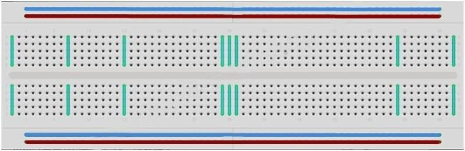
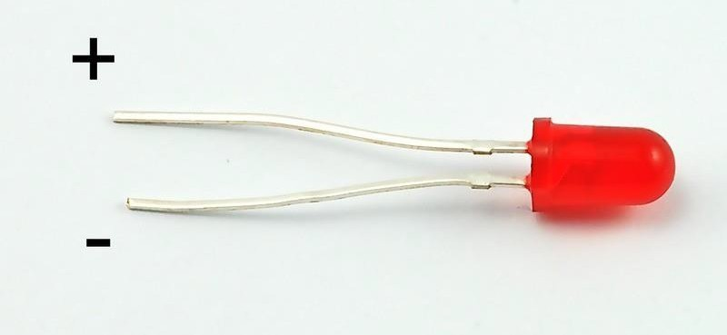
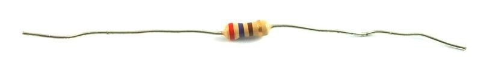
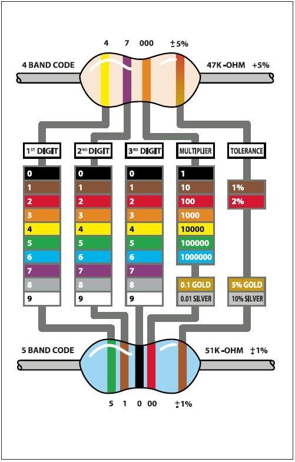
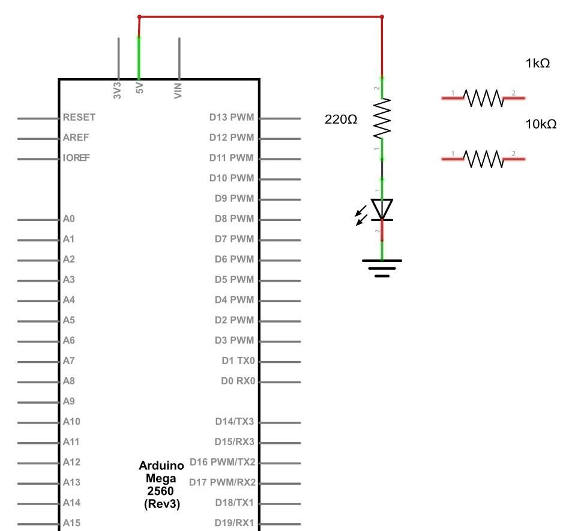
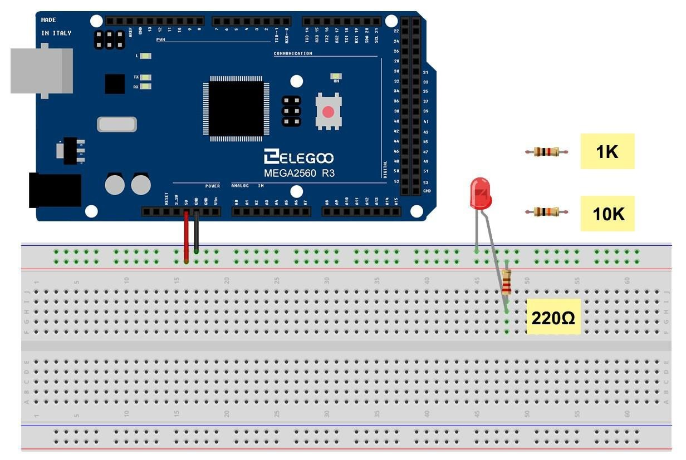
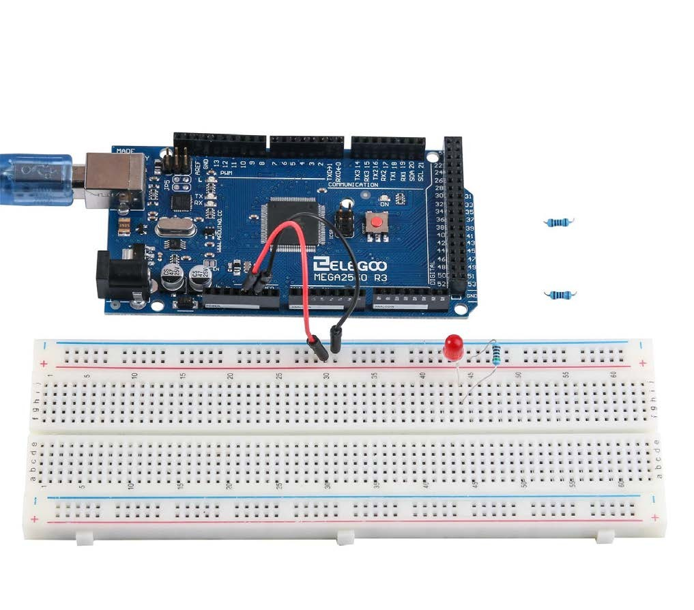

## LED

### Overview

In this lesson, you will learn how to change the brightness of an LED by using
different values of resistor.

### Component Required:

(1) x Elegoo Mega 2560 R
(1) x 5mm red LED
(1) x 220 ohm resistor
(1) x 1k ohm resistor
(1) x 10k ohm resistor
(2) x M -M wires (Male to Male jumper wires)

### Component Introduction

#### BREADBOARD MB-102 ：

A breadboard enables you to prototype circuits quickly, without having to solder
the connections. Below is an example.

Breadboards come in various sizes and configurations. The simplest kind is just a
grid of holes in a plastic block. Inside are strips of metal that provide electrical
connection between holes in the shorter rows. Pushing the legs of two different
components into the same row joins them together electrically. A deep channel
running down the middle indicates that there is a break in connections there,
meaning, you can push a chip in with the legs at either side of the channel without
connecting them together. Some breadboards have two strips of holes running
along the long edges of the board that are separated from the main grid. These have
strips running down the length of the board inside and provide a way to connect a
common voltage. They are usually in pairs for +5 volts and ground. These strips are
referred to as rails and they enable you to connect power to many components or
points in the board.
While breadboards are great for prototyping, they have some limitations. Because
the connections are push-fit and temporary, they are not as reliable as soldered
connections. If you are having intermittent problems with a circuit, it could be due
to a poor connection on a breadboard.

#### LED:

LEDs make great indicator lights. They use very little electricity and they pretty much
last forever.
In this lesson, you will use perhaps the most common of all LEDs: a 5 mm red LED.
5 mm refers to the diameter of the LED. Other common sizes are 3 mm and 10 mm.
You cannot directly connect an LED to a battery or voltage source because 1) the
LED has a positive and a negative lead and will not light if placed the wrong way and
2) an LED must be used with a resistor to limit or 'choke' the amount of current
flowing through it; otherwise, it will burn out!

If you do not use a resistor with an LED, then it may well be destroyed almost
immediately, as too much current will flow through, heating it and destroying the
'junction' where the light is produced.
There are two ways to tell which is the positive lead of the LED and which the
negative.
Firstly, the positive lead is longer.
Secondly, where the negative lead enters the body of the LED, there is a flat edge
to the case of the LED.
If you happen to have an LED that has a flat side next to the longer lead, you should
assume that the longer lead is positive.

**RESISTORS:**
As the name suggests, resistors resist the flow of electricity. The higher the value of
the resistor, the more it resists and the less electrical current will flow through it.
We are going to use this to control how much electricity flows through the LED and
therefore, how brightly it shines.

But first, more about resistors...
The unit of resistance is called the Ohm, which is usually shortened to Ω the Greek
letter Omega. Because an Ohm is a low value of resistance (it doesn't resist much at
all), we also denote the values of resistors in kΩ (1,000 Ω) and MΩ (1,000,000 Ω).
These are called kilo-ohms and mega-ohms.
In this lesson, we are going to use three different values of resistor: 220Ω, 1kΩ and
10kΩ. These resistors all look the same, except that they have different colored
stripes on them. These stripes tell you the value of the resistor.
The resistor color code has three colored stripes and then a gold stripe at one end.

Unlike LEDs, resistors do not have a positive and negative lead. They can be
connected either way around.
If you find this approach method too complicated, you can read the color ring flag
on our resistors directly to determine its resistance value. Or you may use a digital
multimeter instead.

### Connection

**Schematic**

**Wiring diagram**

The MEGA 2560 is a convenient source of 5 volts, which we will use to provide
power to the LED and the resistor. You do not need to do anything with your
MEGA 2560, except to plug it into a USB cable.
With the 220 Ω resistor in place, the LED should be quite bright. If you swap out the
220 Ω resistor for the 1kΩ resistor, then the LED will appear a little dimmer. Finally,
with the 10 kΩ resistor in place, the LED will be just about visible. Pull the red jumper
lead out of the breadboard and touch it into the hole and remove it, so that it acts
like a switch. You should just be able to notice the difference.
At the moment, you have 5V going to one leg of the resistor, the other leg of the
resistor going to the positive side of the LED and the other side of the LED going to
GND. However, if we moved the resistor so that it came after the LED, as shown
below, the LED will still light.
You will probably want to put the 220Ω resistor back in place.
It does not matter which side of the LED we put the resistor, as long as it is there
somewhere

### Example picture

