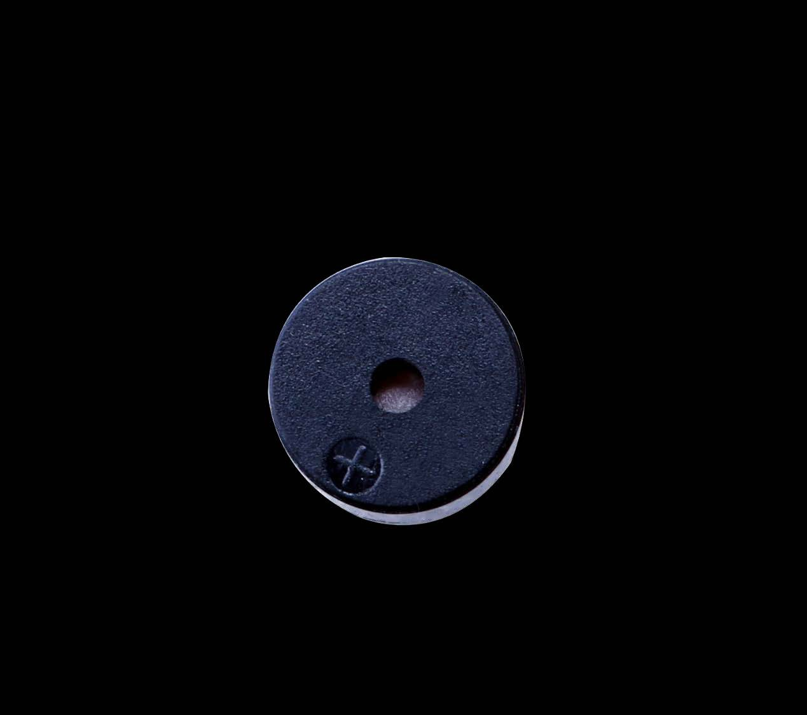
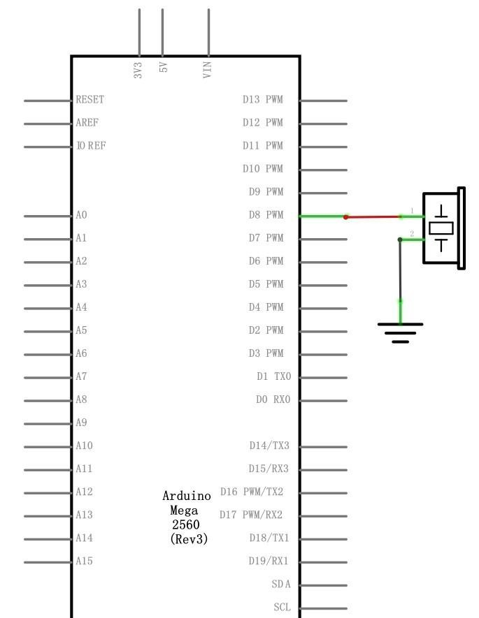
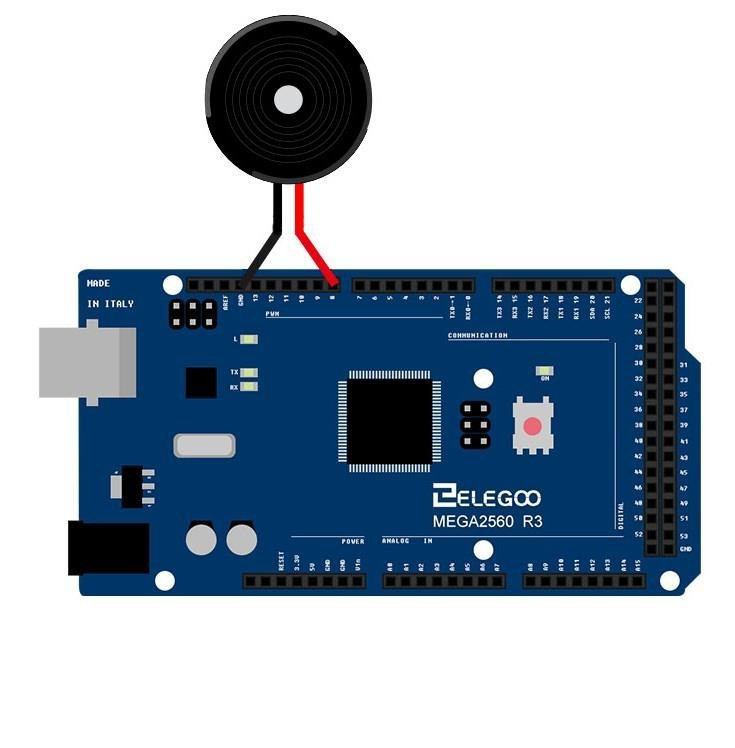

## Passive Buzzer

### Overview
In this lesson, you will learn how to use a passive buzzer.

The purpose of the experiment is to generate eight different sounds, each sound lasting 0.5 seconds: from Alto Do (523Hz), Re (587Hz), Mi (659Hz), Fa (698Hz), So (784Hz), La (880Hz), Si (988Hz) to Treble Do (1047Hz).

### Component Required:

(1) x Elegoo Mega 2560 R3

(1) x Passive buzzer

(2) x F-M wires (Female to Male DuPont wires)

### Component Introduction

**Passive Buzzer:**

The working principle of passive buzzer is using PWM generating audio to make the air to vibrate. Appropriately changed as long as the vibration frequency, it can generate different sounds. For example, sending a pulse of 523Hz, it can generate Alto Do, pulse of 587Hz, it can generate midrange Re, pulse of 659Hz, it can produce midrange Mi. By the buzzer, you can play a song. 

We should be careful not to use the MEGA 2560 R3 board analog Write () function to generate a pulse to the buzzer, because the pulse output of analog Write () is fixed.



### Connection

**Schematic**



**Wiring diagram**



Wiring the buzzer connected to the MEGA 2560 R3 board, the red (positive) to the pin8, black wire (negative) to the GND.

### Code

```C++
#include "pitches.h"
 
// notes in the melody:
int melody[] = {
  NOTE_C5, NOTE_D5, NOTE_E5, NOTE_F5, NOTE_G5, NOTE_A5, NOTE_B5, NOTE_C6};
int duration = 500;  // 500 miliseconds
 
void setup() {
 
}
 
void loop() {  
  for (int thisNote = 0; thisNote < 8; thisNote++) {
    // pin8 output the voice, every scale is 0.5 sencond
    tone(8, melody[thisNote], duration);
     
    // Output the voice after several minutes
    delay(1000);
  }
   
  // restart after two seconds 
  delay(2000);
}
```

**Pitches Library (pitches.h)**
```C++
/*************************************************
 * Public Constants
 *************************************************/
 
#define NOTE_B0  31
#define NOTE_C1  33
#define NOTE_CS1 35
#define NOTE_D1  37
#define NOTE_DS1 39
#define NOTE_E1  41
#define NOTE_F1  44
#define NOTE_FS1 46
#define NOTE_G1  49
#define NOTE_GS1 52
#define NOTE_A1  55
#define NOTE_AS1 58
#define NOTE_B1  62
#define NOTE_C2  65
#define NOTE_CS2 69
#define NOTE_D2  73
#define NOTE_DS2 78
#define NOTE_E2  82
#define NOTE_F2  87
#define NOTE_FS2 93
#define NOTE_G2  98
#define NOTE_GS2 104
#define NOTE_A2  110
#define NOTE_AS2 117
#define NOTE_B2  123
#define NOTE_C3  131
#define NOTE_CS3 139
#define NOTE_D3  147
#define NOTE_DS3 156
#define NOTE_E3  165
#define NOTE_F3  175
#define NOTE_FS3 185
#define NOTE_G3  196
#define NOTE_GS3 208
#define NOTE_A3  220
#define NOTE_AS3 233
#define NOTE_B3  247
#define NOTE_C4  262
#define NOTE_CS4 277
#define NOTE_D4  294
#define NOTE_DS4 311
#define NOTE_E4  330
#define NOTE_F4  349
#define NOTE_FS4 370
#define NOTE_G4  392
#define NOTE_GS4 415
#define NOTE_A4  440
#define NOTE_AS4 466
#define NOTE_B4  494
#define NOTE_C5  523
#define NOTE_CS5 554
#define NOTE_D5  587
#define NOTE_DS5 622
#define NOTE_E5  659
#define NOTE_F5  698
#define NOTE_FS5 740
#define NOTE_G5  784
#define NOTE_GS5 831
#define NOTE_A5  880
#define NOTE_AS5 932
#define NOTE_B5  988
#define NOTE_C6  1047
#define NOTE_CS6 1109
#define NOTE_D6  1175
#define NOTE_DS6 1245
#define NOTE_E6  1319
#define NOTE_F6  1397
#define NOTE_FS6 1480
#define NOTE_G6  1568
#define NOTE_GS6 1661
#define NOTE_A6  1760
#define NOTE_AS6 1865
#define NOTE_B6  1976
#define NOTE_C7  2093
#define NOTE_CS7 2217
#define NOTE_D7  2349
#define NOTE_DS7 2489
#define NOTE_E7  2637
#define NOTE_F7  2794
#define NOTE_FS7 2960
#define NOTE_G7  3136
#define NOTE_GS7 3322
#define NOTE_A7  3520
#define NOTE_AS7 3729
#define NOTE_B7  3951
#define NOTE_C8  4186
#define NOTE_CS8 4435
#define NOTE_D8  4699
#define NOTE_DS8 4978
```