Lesson 2: Potentiometer & LED Brightness Control
--------------------------------------------------------------

### 1. Introduction

Ask the question: *"How can we control the brightness of an LED, not just turn it on or off?"* Explain that real-world devices don't work with just two states—they need to vary their output based on input. Today, we learn about **analog signals** and how to read sensors like a potentiometer to create dynamic control.

### 2. Setup

Ensure everyone still has their **VS Code** and **PlatformIO** project open.

-   **Target Board:** Arduino Mega 2560 (from the ELEGOO Mega R3 Ultimate Kit.)

-   **Analog vs. Digital:** Explain the difference:

    -   **Digital:** Only two states: HIGH (1) or LOW (0)—like a light switch.

    -   **Analog:** Continuous range of values (0-1023 on the Mega 2560)—like a volume knob.

-   **Pulse Width Modulation (PWM):** Explain that the Arduino uses PWM to simulate analog output on digital pins. The faster it switches on/off, the brighter the LED appears.

### 3. The Coding Activity

Replace the code in `src\main.cpp` with the following. Type it out to build muscle memory:

```C++
#include <Arduino.h>

int potPin = A0;      // Potentiometer connected to analog pin A0
int ledPin = 9;       // LED connected to PWM pin 9

void setup() {
  Serial.begin(9600);
  pinMode(ledPin, OUTPUT);
  Serial.println("--- POTENTIOMETER & LED CONTROL ---");
  Serial.println("Turn the potentiometer knob to control LED brightness");
}

void loop() {
  // Read the analog value (0-1023)
  int potValue = analogRead(potPin);
  
  // Convert to LED brightness (0-255)
  int brightness = map(potValue, 0, 1023, 0, 255);
  
  // Set the LED brightness
  analogWrite(ledPin, brightness);
  
  // Print to Serial Monitor to see the values
  Serial.print("Pot Value: ");
  Serial.print(potValue);
  Serial.print(" | Brightness: ");
  Serial.println(brightness);
  
  delay(500); // Update every 500ms
}

```

Experiment by:
- Changing the delay values
- Turning the potentiometer and watching the output
- Modifying the map range to see how it affects brightness

### 4. Hardware Connection

**Parts needed:**
- Board and Breadboard
- 1 Potentiometer (10kΩ)
- 1 LED
- 1 100Ω or 220Ω resistor
- 5 wires

**Wiring:**
-   **Potentiometer:**
    -   Left pin → 5V
    -   Middle pin → A0 (analog pin)
    -   Right pin → GND

-   **LED:**
    -   Long leg (anode) → Pin 9 (PWM pin) with 100Ω resistor in series
    -   Short leg (cathode) → GND

**Breadboard Schematic (Single LED Setup):**

```mermaid
graph TD
    A["🔌 Arduino Mega 2560"] 
    B["⚡ 5V"]
    C["⏚ GND"]
    D["📊 A0 Analog Pin"]
    E["🔌 Pin 9 PWM"]
    F["⚙️ Potentiometer 10kΩ"]
    G["🛠️ 100Ω Resistor"]
    H["💡 LED"]
    
    A --> B
    A --> C
    A --> D
    A --> E
    
    B --> |"Left Pin"| F
    F --> |"Middle Pin"| D
    F --> |"Right Pin"| C
    
    E --> G
    G --> H
    H --> C
    
    style A fill:#4a90e2,stroke:#2c5aa0,color:#fff
    style B fill:#ffb84d,stroke:#e6a000,color:#000
    style C fill:#333,stroke:#000,color:#fff
    style D fill:#7ed321,stroke:#5fa018,color:#000
    style E fill:#7ed321,stroke:#5fa018,color:#000
    style F fill:#f5a623,stroke:#d68910,color:#fff
    style G fill:#bd10e0,stroke:#8b0aa8,color:#fff
    style H fill:#ff0000,stroke:#cc0000,color:#fff
```



-   Click **Build** then **Upload and Monitor** in the PlatformIO pane.

* * * * *

🔍 Key Teaching Points (The "Why")
----------------------------------

-   **Analog vs. Digital:** Digital pins are binary (on/off). Analog pins can measure a range of values, giving us "shades" of control instead of just on/off.

-   **The `analogRead()` Function:** Reads the voltage on an analog pin and returns a value from 0 to 1023 (for 10-bit resolution).

-   **The `map()` Function:** Converts one range of numbers to another. We use it to convert the pot's 0-1023 value to the LED's 0-255 brightness range.

-   **PWM (Pulse Width Modulation):** The Arduino rapidly switches the pin on and off. The longer it's "on," the brighter the LED. This creates the illusion of varying brightness on a digital pin.

-   **Why Pin 9?** Not all pins support PWM. On the Mega 2560, look for pins marked with ~ (like 9, 10, etc.).

* * * * *

📺 Recommended Class Resource
-----------------------------

-   **[Understanding Analog Input on Arduino](https://www.youtube.com/watch?v=BU-MqLaE0qI)**

    -   **Classroom Use:** Play the first 4 minutes to show how potentiometers work and what the Serial Monitor should display.

-   **[PWM (Pulse Width Modulation) Explained](https://www.youtube.com/watch?v=yzV6qI8VJHA)**

    -   **Classroom Use:** Play this to help students understand why PWM makes the LED appear to have different brightness levels.

🔨 Exercise
------------------------------

**Parts needed**
  - Board and Breadboard
  - 1 Potentiometer (10kΩ)
  - 2 LEDs (different colors if available)
  - 2 resistors (100Ω or 220Ω each)
  - 7 wires

**Breadboard Schematic (Dual LED Setup):**

```mermaid
graph TD
    A["🔌 Arduino Mega 2560"] 
    B["⚡ 5V"]
    C["⏚ GND"]
    D["📊 A0 Analog Pin"]
    E["🔌 Pin 9 PWM"]
    F["🔌 Pin 10 PWM"]
    G["⚙️ Potentiometer 10kΩ"]
    R["🛠️ Resistor 1 100Ω"]
    LED1["🔴 Red LED"]
    RES2["🛠️ Resistor 2 100Ω"]
    LED2["🟢 Green LED"]
    
    A --> B
    A --> C
    A --> D
    A --> E
    A --> F
    
    B --> |"Left Pin"| G
    G --> |"Middle Pin"| D
    G --> |"Right Pin"| C
    
    E --> R
    R --> LED1
    LED1 --> C
    
    F --> RES2
    RES2 --> LED2
    LED2 --> C
    
    style A fill:#4a90e2,stroke:#2c5aa0,color:#fff
    style B fill:#ffb84d,stroke:#e6a000,color:#000
    style C fill:#333,stroke:#000,color:#fff
    style D fill:#7ed321,stroke:#5fa018,color:#000
    style E fill:#7ed321,stroke:#5fa018,color:#000
    style F fill:#7ed321,stroke:#5fa018,color:#000
    style G fill:#f5a623,stroke:#d68910,color:#fff
    style R fill:#bd10e0,stroke:#8b0aa8,color:#fff
    style LED1 fill:#ff4444,stroke:#cc0000,color:#fff
    style RES2 fill:#bd10e0,stroke:#8b0aa8,color:#fff
    style LED2 fill:#44ff44,stroke:#00cc00,color:#000
```



**Code Challenge:**
```C++
#include <Arduino.h>

int potPin = A0;       // Potentiometer
int redLedPin = 9;     // First LED (PWM pin)
int greenLedPin = 10;  // Second LED (PWM pin)

void setup() {
  Serial.begin(9600);
  pinMode(redLedPin, OUTPUT);
  pinMode(greenLedPin, OUTPUT);
  Serial.println("--- DUAL LED BRIGHTNESS CONTROL ---");
}

void loop() {
  int potValue = analogRead(potPin);
  int brightness = map(potValue, 0, 1023, 0, 255);
  
  // Make the red LED brighter as pot increases
  analogWrite(redLedPin, brightness);
  
  // Make the green LED brighter as pot decreases (inverse)
  analogWrite(greenLedPin, 255 - brightness);
  
  Serial.print("Red: ");
  Serial.print(brightness);
  Serial.print(" | Green: ");
  Serial.println(255 - brightness);
  
  delay(500);
}

```

**Test & Explore:**
- Turn the potentiometer slowly and watch both LEDs change
- Can you see how the red LED gets brighter while the green gets dimmer?
- What happens if you change the map range values?
- Add a third LED connected to another PWM pin and control its brightness independently

**Challenge:** Modify the code to make one LED pulse while the other stays at a fixed brightness based on the potentiometer value.
