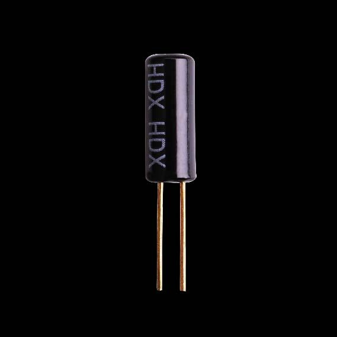
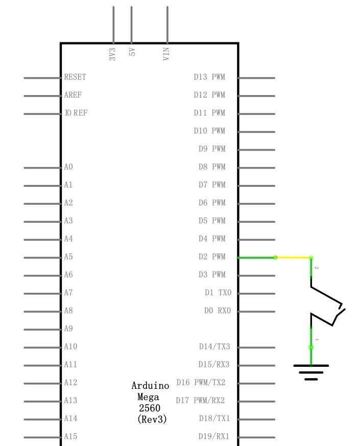
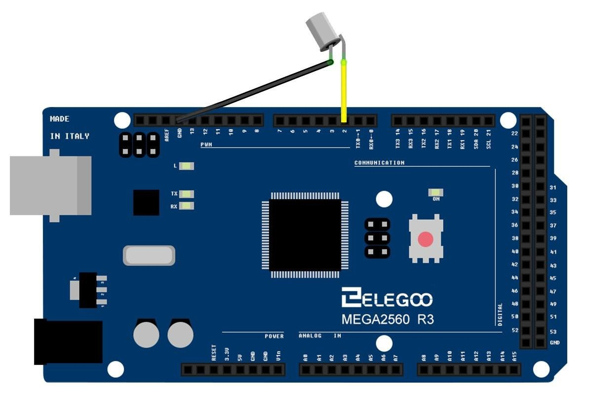

## Passive Buzzer

### Overview
In this lesson, you will learn how to use a tilt ball switch in order to detect small angle of inclination.

### Component Required:

(1) x Elegoo Mega 2560 R3

(1) x Tilt Ball switch

(2) x F-M wires (Female to Male DuPont wires)



### Component Introduction

**Tilt sensor:**

Tilt sensors (tilt ball switch) allow you to detect orientation or inclination. They are small, inexpensive, low-power and easy-to-use. If used properly, they will not wear out. Their simplicity makes them popular for toys, gadgets and appliances. Sometimes, they are referred to as "mercury switches", "tilt switches" or "rolling ball sensors" for obvious reasons. 

They are usually made up of a cavity of some sort (cylindrical is popular, although not always) with a conductive free mass inside, such as a blob of mercury or rolling ball. One end of the cavity has two conductive elements (poles). When the sensor is oriented so that that end is downwards, the mass rolls onto the poles and shorts them, acting as a switch throw.

While not as precise or flexible as a full accelerometer, tilt switches can detect motion or orientation. Another benefit is that the big ones can switch power on their own. Accelerometers, on the other hand, output digital or analog voltage that must then be analyzed using extra circuitry.

### Connection

**Schematic**



**Wiring diagram**



### Code

```C++
const int ledPin = 13;//the led attach to

void setup()
{ 
  pinMode(ledPin,OUTPUT);//initialize the ledPin as an output
  pinMode(2,INPUT);
  digitalWrite(2, HIGH);
} 
/******************************************/
void loop() 
{  
  int digitalVal = digitalRead(2);
  if(HIGH == digitalVal)
  {
    digitalWrite(ledPin,LOW);//turn the led off
  }
  else
  {
    digitalWrite(ledPin,HIGH);//turn the led on 
  }
}
/**********************************************/
```